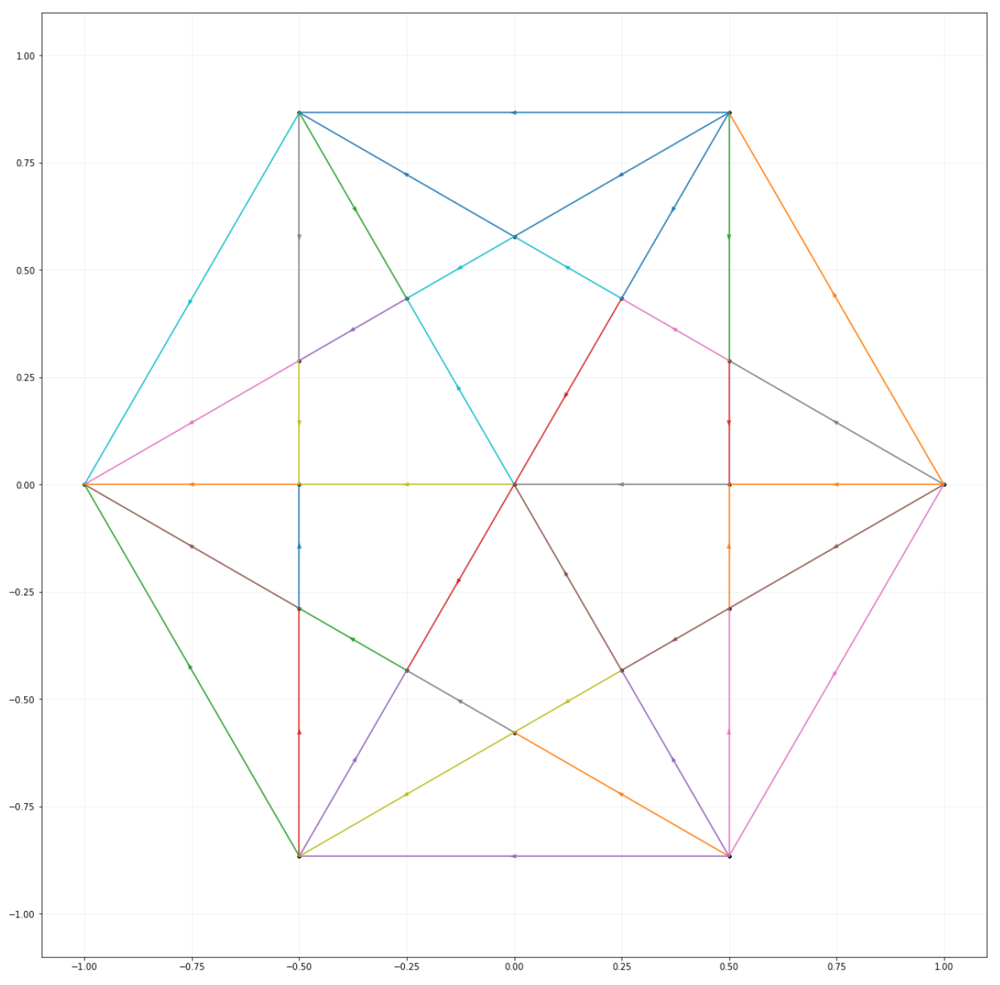
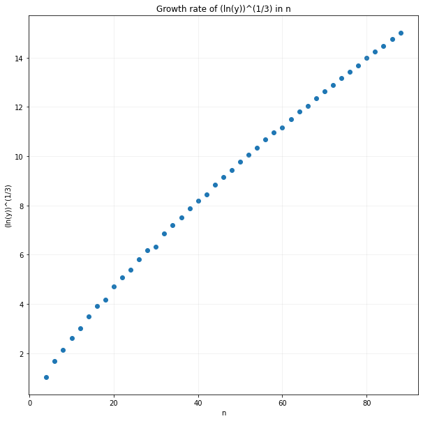

# Polygons

## The Problem

Consider an n-sided polygon where n is even. We draw all the lines that connect the vertices, and mark out the intersection points. This creates a graph with the vertices and intersection points as the nodes of the graph, and the edges are the line segments between the vertices and the intersection points. We define a start point and an end point as the opposite vertices of the polygon. We also define a "decreasing path" as a path along the edges of the graph that links the start point to the end point, where the distance to the end point is strictly decreasing while moving along the path. Find the total number of decreasing paths available.

   

## The Solution

A solution is provided in `polygons.ipynb`. We think that the growth rate in _n_ (where _n_ is the number of sides of the polygon) is _exp(n^3)_.

   

### Create the regular polygon

`PolygonSolver.__init__()`

Let's first create the regular polygon.

1. Centred on (0,0) with radius 1 unit; thus start point is (1,0) and end point is (-1,0)
2. Use the internal angle of a polygon to find the points of the vertices

Some of the code for Line and Point classes (on the implementation of Cramer's rule) are adapted from https://stackoverflow.com/a/20679579. Also written with mathematical reference to https://observablehq.com/@toja/line-box-intersection.

### Find the intersection points

Next, we draw a line segment for every pair of polygon vertices. We then find the intersection points of every pair of line segments.

### Get all the line segments

Every line segment in the diagram above fulfills the following conditions:

1. Both ends of the line segment must be either an intersection point or a vertex
2. They must be an equal or shorter line deriving from one of the already drawn lines

A possible approach would be to:

1. For every line segment that we have generated, first find which points/vertices lie on it.
2. Break up the line segment into smaller line segments where possible
   - Sort the points by x, then within that by y.
   - Line segments are built by going across the list and taking a pair of points as line segments

### Label all the line segments

Due to the "decreasing path" constraint, there can only be one direction of movement for an edge. We can say that every edge in the graph must be directed. Right angles are particularly helpful in determining where the edge directions point towards.

### Solving the graph

A possible approach would be to find the value of the number of paths to reach a node from the start point. We can solve this recursively as the value of any node in the graph is the sum of the value of the points that it is dependent on.
