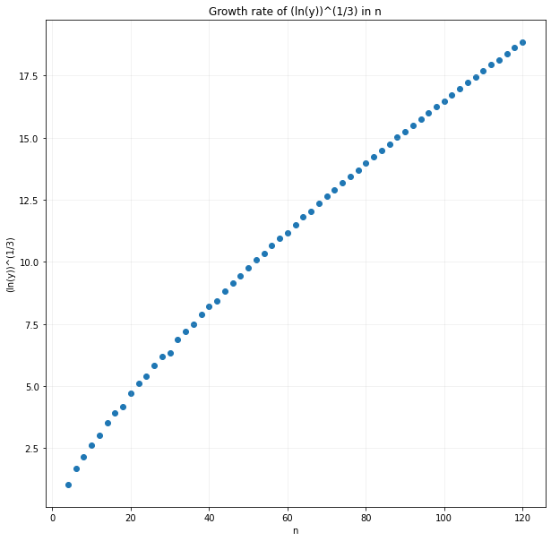

# Polygons

## The Problem

Consider an n-sided polygon where n is even. We draw all the lines that connect the vertices, and mark out the intersection points. This creates a graph with the vertices and intersection points as the nodes of the graph, and the edges are the line segments between the vertices and the intersection points.

A start point and an end point are two opposite vertices of the polygon. A "decreasing path" is a path travelling on the edges of the graph that links the start point to the end point, where the distance to the end point is strictly decreasing while moving along the path.

1. Find the total count of unique decreasing paths for a given _n_ (e.g. n=4).
2. How does the count of unique decreasing paths grow as _n_ increases?

This repository attempts to answer the question by computing the total number of unique decreasing paths.

   

Figure 1 - Direction of movement for n=4

   

Figure 2 - Graph values for n=4

   

Figure 3 - Direction of movement for n=6

   

Figure 4 - Graph values for n=6

   

Figure 5 - Direction of movement for n=16

## The Solution

We think that the growth rate in _n_ (where _n_ is the number of sides of the polygon) is _exp(n^3)_.

   

### Create the regular polygon

1. We want to create the regular polygon that is centred on (0,0) with radius 1 unit; thus start point is (1,0) and end point is (-1,0).
2. From the start point (1,0), we generate all the rest of the exterior polygon points.
3. We draw a line segment for every pair of polygon vertices.
4. (Vertices) We find the intersection points of every pair of (unbroken) line segments. These are the vertices of the graph.
   - As we generate the intersection points of every line segment, we also store a mapping of unbroken line segments to points.
   - Stable sort the points by their x, y coordinates
   - (Edges) Generate the smaller (broken) line segments.
5. Generate the adjacency list representation of the graph.
   - Every edge in the graph must be directed.
6. Solve the graph
   - We want to find the number of unique ways we can get to the end point
   - Define the value of a node A: as the sum of values from the nodes of incoming edges to node A
   - Define the value of the start point to be 1, since there is only 1 unique way of getting there from the start point
   - Can either be solved recursively or iteratively

### Useful references

1. Returns the theoretical number of nodes in regular n-gon with all diagonals drawn.
   - https://oeis.org/A007569
2. Returns the theoretical number of regions in regular n-gon with all diagonals drawn.
   - https://oeis.org/A007678
3. Returns the theoretical number of line segments in regular n-gon with all diagonals drawn.
   - https://oeis.org/A135565
4. Paper that provides the values for the above
   - https://math.mit.edu/~poonen/papers/ngon.pdf

### Problems

1. Hitting the Python recursion limit
   - The original solver was written recursively and we ran into problems.
   - We raised the Python recursion limit to 30000, and it worked up until n=88.
   - The problem is a dynamic programming problem which we can solve iteratively (bottom-up) as opposed to recursively (top-down).
   - Rewriting it iteratively required us to solve the larger problem by utilising smaller subproblems.
     - Requires a topological order of the directed acyclic graph (DAG) for us to progressively solve it with known values
     - Once this was completed, the recursion limit was no longer an issue but running time continues to be.
     - We were able to calculate until n=120 (where the running time is roughly 500s (~8 min) per solve)
2. How can we go faster?
   - Rewriting in a compiled language
   - Utilising parallelism
   - Utilising symmetry
   - Finding a faster algorithm / Optimising the existing algorithm
3. Need runtime verification of the numbers that are being generated
   - Unit testing, while helpful for regression testing, is insufficient
   - Requiring a strong test of the generated results (i.e. if x, then z.)
     - Perhaps if we can verify that the generated adjacency list representation is correct, then we can say the result is correct.
     - This is because all that is left is the summation across the node values.
